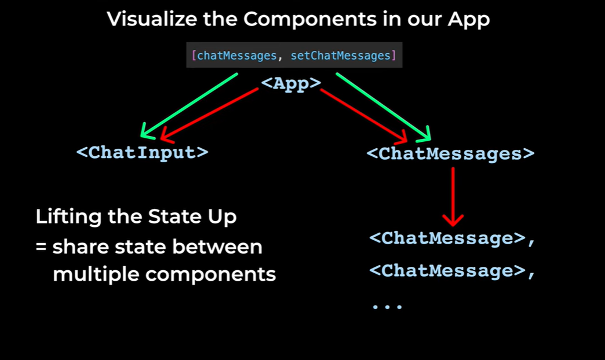

# State, Event Handlers, Chatbot Project Features

## Event Handlers

Run a function when we interact with the website.

```jsx
<button onClick={sendMessage}>Send message</button>
```

- `onClick` = Event
- `sendMessage` = Event Handler

## State

**State** = data that is connected to the HTML. When we update this data, it will update the HTML.

- If we update the data directly, React will **not** update the HTML.
- If we use the updater function to update the data, React **will** update the HTML.

In React, we should not modify the data directly — we should always create a copy, and then modify the copy. (This helps React be more efficient.)

### Spread Operator (`...`)

Takes the values in an array and copies them into a new array.

```jsx
const array = React.useState([]);
const chatMessages = array[0];      // current data
const setChatMessages = array[1];   // updater function
```

`useState()` gives 2 values: the current data and the updater function.

### Array Destructuring

```jsx
const [chatMessages, setChatMessages] = array;

const [chatMessages, setChatMessages] = React.useState([]);
```

## React Best Practice

Don't use the DOM manually — React is managing the website.

We should use React features to get the text from a textbox.

`onChange` = runs a function when we change the text inside an `<input>`. We give it a parameter named `event`.

## Lifting the State Up



### Naming Convention

Naming convention used in the React Documentation — all names stay the same.

## State Updates Are Not Immediate

In React, state does not update immediately. State is updated after all of the code is finished.

**React** = external library that helps us create websites easier. Update the state → React automatically updates the website.

## Summary

In this lesson:

1. Save the data (using arrays and objects).
2. Generate the HTML (using `.map()` and the `key` prop).
3. Make it interactive, using `onClick` and `onChange`.
4. State → data that changes over time and is connected to the HTML.
5. Updater function → update the state and update the HTML.
6. Array destructuring.
7. Lifting the State Up → share state between components.
8. Made `<ChatInput>` interactive.
9. Got responses from the Chatbot.