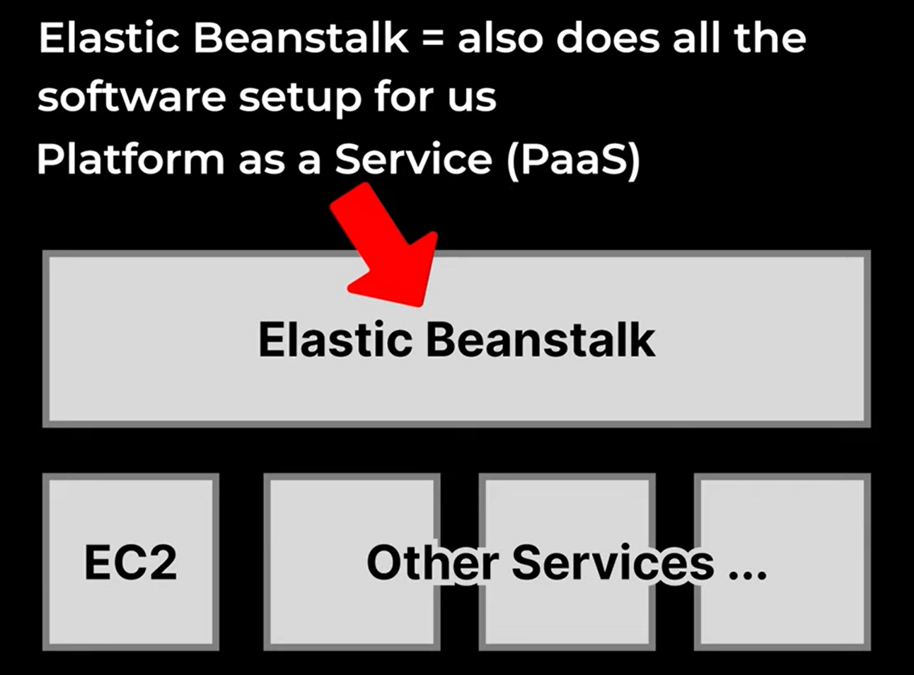
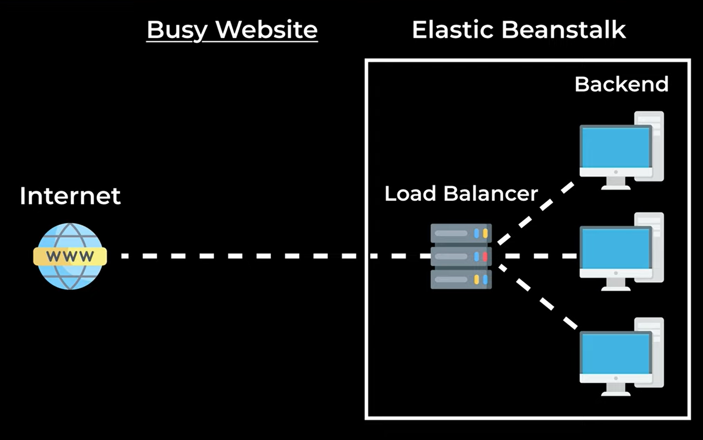
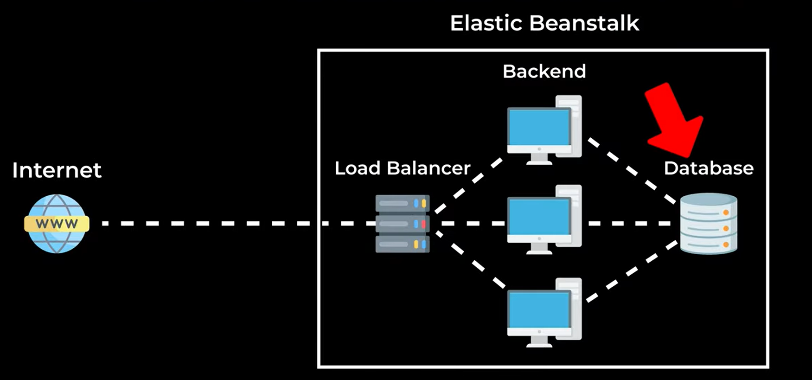

# Deploying React to the Internet: Intro to AWS

**Deploying** = putting a React app on the Internet.

We'll use **AWS (Amazon Web Services)** — a collection of services that help us put stuff on the Internet. There are a lot of services, so this guide covers the key ones for deploying a React app.

## Table of Contents

1. [AWS Overview](#aws-overview)
2. [EC2 (IaaS)](#ec2-iaas)
3. [Elastic Beanstalk (PaaS)](#elastic-beanstalk-paas)
4. [Building the Frontend](#building-the-frontend)
5. [Deploying React Without a Backend](#deploying-react-without-a-backend)
6. [Load Balancer and Database](#load-balancer-and-database)
7. [Domain Name, SSL, and HTTPS](#domain-name-ssl-and-https)
8. [Summary](#summary)

## AWS Overview

AWS is a collection of services that put stuff on the Internet.

## EC2 (IaaS)

**EC2** = Elastic Compute Cloud — rent a computer from AWS.

This is called **Infrastructure as a Service (IaaS)**.

- 1 instance = 1 EC2 computer
- EC2 just gives us a computer — it doesn't set anything up for us

With EC2 alone, we still need to:

1. Install Node.js
2. Connect it to the Internet
3. Upload our code

### Instance Types

- `t3.micro`
- `t3.small`

## Elastic Beanstalk (PaaS)

**Elastic Beanstalk** — run and manage web apps.

1. Uses EC2 to rent a computer
2. Installs all the software we need

This is called **Platform as a Service (PaaS)** — it manages both the infrastructure and the software for us.



**Role** = gives Elastic Beanstalk permission to use other services in AWS.

## Building the Frontend

In the frontend project:

```bash
npm run build
```

This is a Vite feature. It:

- Converts JSX into plain JavaScript
- Saves the output in the `dist` folder
- Minifies (compresses) the code

## Deploying React Without a Backend

If a React app doesn't have a backend, we can put the code on the Internet directly.

`dist` is just an HTML website.

## Load Balancer and Database



We usually put the database on a separate computer.



## Domain Name, SSL, and HTTPS

### Set Up a Domain Name

- **Namecheap** — register a domain name

### Connect the Domain in AWS

- **Route 53** — manage domain names in AWS
- **Hosted Zone** — lets us connect a domain name to our app

### SSL Certificate

- **AWS Certificate Manager** — issues the SSL certificate

### HTTPS

- HTTPS uses listener port **443**

## Summary

1. **AWS** — a collection of services that put stuff on the Internet
2. **EC2** — rent a computer from AWS (IaaS)
3. **Elastic Beanstalk** — sets up all the software (PaaS)
4. Put our backend on the Internet
5. Build and optimize the frontend, then put it on the Internet
6. How to deploy React without a backend
7. Added a load balancer and database
8. Set up a domain name, SSL certificate, and HTTPS